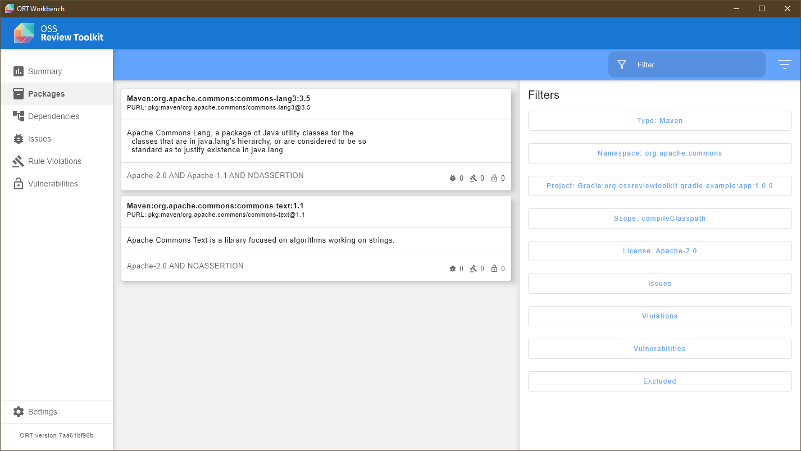

# ORT Workbench

[](https://github.com/oss-review-toolkit/ort-workbench/actions/workflows/build.yml)
[](https://github.com/oss-review-toolkit/ort-workbench/actions/workflows/static-analysis.yml)
[](https://github.com/oss-review-toolkit/ort-workbench/actions/workflows/gradle-wrapper-validation.yml)

A basic workbench for [ORT](https://oss-review-toolkit.org) result files, implemented with
[Compose Desktop](https://www.jetbrains.com/lp/compose-mpp/).



## Getting Started

The are currently no binary builds published, to run the workbench clone the repository and execute:

```shell
./gradlew run
```

## Roadmap

### Implemented Features

* Dependency tree
* Issue list
* Package list
* Rule violation list
* Vulnerability list

### Planned Features

* Defect list
* Scan result view
* `.ort.yml` editor
* Curation editor
* Package configuration editor
* Resolution editor
* Run ORT tools from the workbench

# License

Copyright (C) 2022 Martin Nonnenmacher

This project is published under the [Apache-2.0](https://www.apache.org/licenses/LICENSE-2.0.html) license, see the
[LICENSE](./LICENSE) file in the root of this project for license details.
